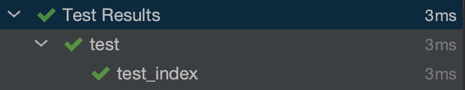

# Unit tests hang when using Docker interpreter

## Expected Behavior

Running a unit test in PyCharm should complete successfully.
Using the "Virtual Environment" interpreter demonstrates this.

1. Create a virtual environment, activate it and install all requirements.

```
python3 -m venv venv
source venv/bin/activate
pip install -r requirements.txt
```

2. Add a **Virtual Environment** Python interpreter by navigating to 
Preferences > Project > Python Interpreter > Gear Icon > Add > Virtual Environment > Existing environment > OK > Apply

```
Python Interpreter: .../pycharm-tests-hang-bug/venv/bin/python
```

3. Within PyCharm, start a unit test in `test.py` by clicking the play button next to the function name.
Notice the test runs successfully to completion and each step has a green checkmark.



## Steps to reproduce bug

1. Build the docker image

```
docker image build --tag flaskapp:latest .
```

2. Add a **Docker** Python interpreter by navigating to 
Preferences > Project > Python Interpreter > Gear Icon > Add > Docker > Image name = flaskapp:latest > OK > Apply

```
Python Interpreter: docker://flaskapp:latest/python
```

3. Within PyCharm, start a unit test in `test.py` by clicking the play button next to the function name.
Notice the test passes but the process hangs and several steps are stuck on a spinning wheel.


A restart is required to fix this.
